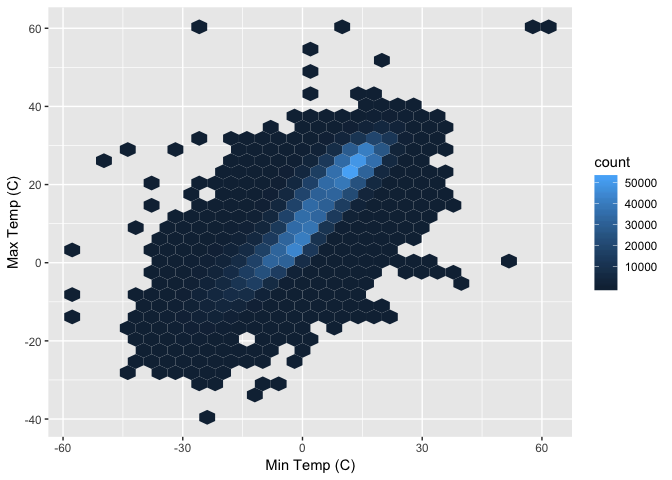
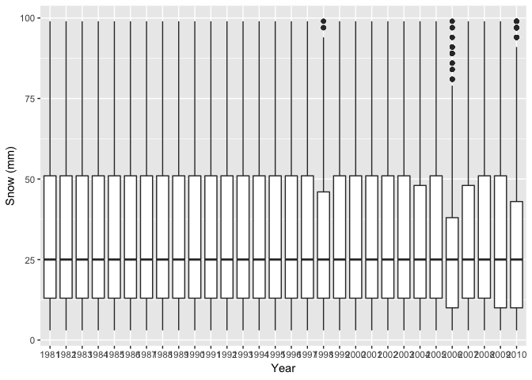

p8105\_hw3\_yw3236
================
Yishan Wang
2018-10-07

Problem 1
=========

``` r
devtools::install_github("p8105/p8105.datasets")
```

    ## Skipping install of 'p8105.datasets' from a github remote, the SHA1 (21f5ad1c) has not changed since last install.
    ##   Use `force = TRUE` to force installation

``` r
library(p8105.datasets)

data(brfss_smart2010)
```

View(brfss\_smart2010)

``` r
formated_brfss_smart2010 = brfss_smart2010 %>%
  janitor::clean_names() %>%
  rename(., state = locationabbr, county = locationdesc) %>%
  filter(., topic == "Overall Health") %>%
  filter(., response == "Excellent" | response == "Very good" | response == "Good" | response == "Fair" | response == "Poor") %>%
  mutate(., response = as.factor(.$response)) %>%
  arrange(., factor(response, levels = c("Excellent", "Very good", "Good", "Fair", "Poor")))

formated_brfss_smart2010
```

    ## # A tibble: 10,625 x 23
    ##     year state county class topic question response sample_size data_value
    ##    <int> <chr> <chr>  <chr> <chr> <chr>    <fct>          <int>      <dbl>
    ##  1  2010 AL    AL - ~ Heal~ Over~ How is ~ Excelle~          94       18.9
    ##  2  2010 AL    AL - ~ Heal~ Over~ How is ~ Excelle~          91       15.6
    ##  3  2010 AL    AL - ~ Heal~ Over~ How is ~ Excelle~          58       20.8
    ##  4  2010 AZ    AZ - ~ Heal~ Over~ How is ~ Excelle~         269       27.3
    ##  5  2010 AZ    AZ - ~ Heal~ Over~ How is ~ Excelle~          68       17  
    ##  6  2010 AZ    AZ - ~ Heal~ Over~ How is ~ Excelle~         133       20.5
    ##  7  2010 AR    AR - ~ Heal~ Over~ How is ~ Excelle~          67       23.1
    ##  8  2010 AR    AR - ~ Heal~ Over~ How is ~ Excelle~         100       29  
    ##  9  2010 AR    AR - ~ Heal~ Over~ How is ~ Excelle~          47       24.1
    ## 10  2010 CA    CA - ~ Heal~ Over~ How is ~ Excelle~         167       24  
    ## # ... with 10,615 more rows, and 14 more variables:
    ## #   confidence_limit_low <dbl>, confidence_limit_high <dbl>,
    ## #   display_order <int>, data_value_unit <chr>, data_value_type <chr>,
    ## #   data_value_footnote_symbol <chr>, data_value_footnote <chr>,
    ## #   data_source <chr>, class_id <chr>, topic_id <chr>, location_id <chr>,
    ## #   question_id <chr>, respid <chr>, geo_location <chr>

View(formated\_brfss\_smart2010)

``` r
formated_brfss_smart2010_2002 = formated_brfss_smart2010 %>%
  filter(., year == "2002") %>%
  select(., year, state, county) %>%
  unique(.) %>%
  group_by(state) %>%
  summarize(n = n())
```

View(formated\_brfss\_smart2010\_2002)

``` r
plot_2002_to_2010 = formated_brfss_smart2010 %>%
  select(., year, state) %>%
  group_by(year, state) %>%
  summarize(n_location = n()) %>%
  ggplot() +
  geom_line(aes(x = year, y = n_location, color = state)) +
  labs(x = "Year", y = "Number of Locations")

plot_2002_to_2010
```

 View(formated\_brfss\_smart2010\_2002\_to\_2010)

``` r
formated_brfss_smart2010_excellent_NY = formated_brfss_smart2010 %>%
  filter(., year == "2002" | year == "2006" | year == "2010") %>%
  filter(., state == "NY") %>%
  select(., year, state, county, response, data_value) %>%
  arrange(., year, county) %>%
  filter(., response == "Excellent") %>%
  group_by(year) %>%
  summarise(mean_ny_excellent = mean(data_value), std_ny_excellent = sqrt(var(data_value))) %>%
  knitr::kable(digits = 1) 

formated_brfss_smart2010_excellent_NY
```

|     year|     mean\_ny\_excellent|  std\_ny\_excellent|
|--------:|-----------------------:|-------------------:|
|     2002|                    24.0|                 4.5|
|     2006|                    22.5|                 4.0|
|     2010|                    22.7|                 3.6|
|  View(fo|  rmated\_brfss\_smart20|  10\_excellent\_NY)|

``` r
response_average_prop = formated_brfss_smart2010 %>%
  select(., year, state, county, response, data_value) %>%
  group_by(year, state, response) %>%
  summarise(average_prop = mean(data_value))

ggplot(response_average_prop, aes(x = year, y = average_prop)) +
  geom_point() +
  facet_grid(~response)
```

    ## Warning: Removed 21 rows containing missing values (geom_point).

 View(response\_average\_prop)

Problem 2
=========

``` r
data(instacart)
```

View(instacart)

``` r
n_aisles = nrow(instacart %>%
  select(., aisle) %>%
  unique(.))

n_aisles
```

    ## [1] 134

``` r
most_order_aisles = instacart %>%
  select(., aisle, product_id) %>%
  arrange(., aisle, product_id) %>%
  group_by(aisle) %>%
  summarise(item_num = n()) %>%
  arrange(., item_num) %>%
  tail(5)

most_order_aisles
```

    ## # A tibble: 5 x 2
    ##   aisle                      item_num
    ##   <chr>                         <int>
    ## 1 packaged cheese               41699
    ## 2 yogurt                        55240
    ## 3 packaged vegetables fruits    78493
    ## 4 fresh fruits                 150473
    ## 5 fresh vegetables             150609

View(most\_order\_aisles)

``` r
order_aisles = instacart %>%
  select(., aisle, product_id) %>%
  arrange(., aisle, product_id) %>%
  group_by(aisle) %>%
  summarise(item_num = n()) %>%
  arrange(., desc(item_num)) %>%
  ggplot() +  
  geom_point(aes(x = reorder(aisle, -item_num), y = item_num, color = item_num)) +
  theme(axis.text.x = element_text(angle = 90, hjust = 1, size = rel(1)))

order_aisles
```

 View(order\_aisles)

``` r
popular_aisles = instacart %>%
  select(., aisle, product_id, product_name) %>%
  filter(., aisle == "baking ingredients" | aisle == "dog food care" | aisle == "packaged vegetables fruits") %>%
  arrange(., aisle, product_id) %>%
  group_by(aisle, product_id, product_name) %>%
  summarise(item_num = n())
  
popular_bi_item = popular_aisles %>%
  filter(., aisle == "baking ingredients") %>%
  arrange(., item_num) %>%
  tail(1)

popular_dfc_item = popular_aisles %>%
  filter(., aisle == "dog food care") %>%
  arrange(., item_num) %>%
  tail(1)

popular_pvf_item = popular_aisles %>%
  filter(., aisle == "packaged vegetables fruits") %>%
  arrange(., item_num) %>%
  tail(1)

tibble(
  ailse = c("baking ingredients", "dog food care", "packaged vegetables fruits"),
  popular_item = c(popular_bi_item$product_name, popular_dfc_item$product_name, popular_pvf_item$product_name)
) %>%
  knitr::kable(digits = 1) 
```

| ailse                      | popular\_item                                 |
|:---------------------------|:----------------------------------------------|
| baking ingredients         | Light Brown Sugar                             |
| dog food care              | Snack Sticks Chicken & Rice Recipe Dog Treats |
| packaged vegetables fruits | Organic Baby Spinach                          |

``` r
mean_hour = instacart %>%
  select(., product_name, order_hour_of_day, order_dow) %>%
  filter(., product_name == "Pink Lady Apples" | product_name == "Coffee Ice Cream") %>%
  group_by(order_dow, product_name) %>%
  summarise(mean_hour_day = mean(order_hour_of_day)) %>%
  rename(day = order_dow) 

table_mean_hour = mean_hour %>%
  mutate(mean_hour_day = round(mean_hour_day, 2)) %>%
  mutate(mean_hour_day = format(mean_hour_day, nsmall = 2)) %>%
  separate(mean_hour_day, into = c("hours", "mins"), sep = "\\.") %>%   
  mutate(mins = round(as.numeric(mins)*0.6)) %>%  
  mutate(average_time_order = paste(hours, "hours", mins, "mins")) %>% 
  select(day, product_name, average_time_order) %>%   
  spread(key = day, value = average_time_order) %>% 
  knitr::kable(digits = 2, col.names = c("Product", "Sun", "Mon", "Tue", "Wed", "Thu", "Fri", "Sat"),
               caption = "Mean Time of Day Most Listed Items Were Ordered")

table_mean_hour
```

| Product          | Sun              | Mon              | Tue              | Wed              | Thu              | Fri              | Sat              |
|:-----------------|:-----------------|:-----------------|:-----------------|:-----------------|:-----------------|:-----------------|:-----------------|
| Coffee Ice Cream | 13 hours 46 mins | 14 hours 19 mins | 15 hours 23 mins | 15 hours 19 mins | 15 hours 13 mins | 12 hours 16 mins | 13 hours 50 mins |
| Pink Lady Apples | 13 hours 26 mins | 11 hours 22 mins | 11 hours 42 mins | 14 hours 15 mins | 11 hours 33 mins | 12 hours 47 mins | 11 hours 56 mins |

Problem 3
=========

``` r
data(ny_noaa)
```

View(ny\_noaa)

``` r
formated_ny_noaa = ny_noaa %>% 
  ungroup() %>%
  mutate(year = format(date, "%Y"), month = format(date, "%m"), day = format(date, "%d")) %>%
  mutate(prcp = prcp/10, tmax = as.numeric(tmax)/10, tmin = as.numeric(tmin)/10) %>%
  select(., id, year, month, day, prcp, snow, snwd, tmax, tmin) 

formated_ny_noaa
```

    ## # A tibble: 2,595,176 x 9
    ##    id          year  month day    prcp  snow  snwd  tmax  tmin
    ##    <chr>       <chr> <chr> <chr> <dbl> <int> <int> <dbl> <dbl>
    ##  1 US1NYAB0001 2007  11    01       NA    NA    NA    NA    NA
    ##  2 US1NYAB0001 2007  11    02       NA    NA    NA    NA    NA
    ##  3 US1NYAB0001 2007  11    03       NA    NA    NA    NA    NA
    ##  4 US1NYAB0001 2007  11    04       NA    NA    NA    NA    NA
    ##  5 US1NYAB0001 2007  11    05       NA    NA    NA    NA    NA
    ##  6 US1NYAB0001 2007  11    06       NA    NA    NA    NA    NA
    ##  7 US1NYAB0001 2007  11    07       NA    NA    NA    NA    NA
    ##  8 US1NYAB0001 2007  11    08       NA    NA    NA    NA    NA
    ##  9 US1NYAB0001 2007  11    09       NA    NA    NA    NA    NA
    ## 10 US1NYAB0001 2007  11    10       NA    NA    NA    NA    NA
    ## # ... with 2,595,166 more rows

``` r
common_snwd = formated_ny_noaa %>%
  select(., snwd) %>%
  filter(., !is.na(snwd)) %>%
  group_by(snwd) %>%
  summarise(n = n()) %>%
  arrange(., n) %>%
  tail(1)

common_snwd
```

    ## # A tibble: 1 x 2
    ##    snwd       n
    ##   <int>   <int>
    ## 1     0 1621683

View(formated\_ny\_noaa) View(common\_snwd)

``` r
jan_jul_temp = formated_ny_noaa %>%
  select(., id, year, month, day, tmax) %>%
  filter(., !is.na(tmax)) %>%
  filter(., month == "01" | month == "07") %>%
  group_by(year, month, id) %>%
  summarise(average_max_temp = mean(tmax))

ggplot(jan_jul_temp, aes(x = year, y = average_max_temp)) +
  geom_point() +
  facet_grid(~month)
```


``` r
ggplot(jan_jul_temp, aes(x = year, y = average_max_temp)) +
  geom_boxplot() +
  facet_grid(~month) 
```

 View(jan\_jul\_temp)

``` r
temp = formated_ny_noaa %>%
  select(., id, year, month, day, tmax, tmin) %>%
  filter(., !is.na(tmax) & !is.na(tmin)) 

temp_plot = ggplot(temp, aes(x = tmin, y = tmax)) +     
  geom_density_2d() +    
  labs(x = "Min Temp (C)",
       y = "Max Temp (C)")

temp_plot
```

 View(temp)

``` r
snowfall = formated_ny_noaa %>%
  select(., id, year, month, day, snow) %>%
  filter(., snow > 0 & snow < 100) %>%
  group_by(year)

snow_plot = ggplot(snowfall) + 
  geom_violin(aes(x = year, y = snow)) +
  labs(x = "Year", y = "Snow (mm)")

snow_plot
```

 View(snowfall)
