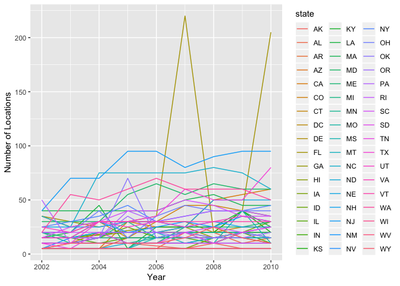

p8105\_hw3\_yw3236
================
Yishan Wang
2018-10-07

Problem 1
=========

``` r
devtools::install_github("p8105/p8105.datasets")
```

    ## Skipping install of 'p8105.datasets' from a github remote, the SHA1 (21f5ad1c) has not changed since last install.
    ##   Use `force = TRUE` to force installation

``` r
library(p8105.datasets)

data(brfss_smart2010)
```

View(brfss\_smart2010)

``` r
formated_brfss_smart2010 = brfss_smart2010 %>%
  janitor::clean_names() %>%
  rename(., state = locationabbr, county = locationdesc) %>%
  filter(., topic == "Overall Health") %>%
  filter(., response == "Excellent" | response == "Very good" | response == "Good" | response == "Fair" | response == "Poor") %>%
  mutate(., response = as.factor(.$response)) %>%
  arrange(., factor(response, levels = c("Excellent", "Very good", "Good", "Fair", "Poor")))

formated_brfss_smart2010
```

    ## # A tibble: 10,625 x 23
    ##     year state county class topic question response sample_size data_value
    ##    <int> <chr> <chr>  <chr> <chr> <chr>    <fct>          <int>      <dbl>
    ##  1  2010 AL    AL - ~ Heal~ Over~ How is ~ Excelle~          94       18.9
    ##  2  2010 AL    AL - ~ Heal~ Over~ How is ~ Excelle~          91       15.6
    ##  3  2010 AL    AL - ~ Heal~ Over~ How is ~ Excelle~          58       20.8
    ##  4  2010 AZ    AZ - ~ Heal~ Over~ How is ~ Excelle~         269       27.3
    ##  5  2010 AZ    AZ - ~ Heal~ Over~ How is ~ Excelle~          68       17  
    ##  6  2010 AZ    AZ - ~ Heal~ Over~ How is ~ Excelle~         133       20.5
    ##  7  2010 AR    AR - ~ Heal~ Over~ How is ~ Excelle~          67       23.1
    ##  8  2010 AR    AR - ~ Heal~ Over~ How is ~ Excelle~         100       29  
    ##  9  2010 AR    AR - ~ Heal~ Over~ How is ~ Excelle~          47       24.1
    ## 10  2010 CA    CA - ~ Heal~ Over~ How is ~ Excelle~         167       24  
    ## # ... with 10,615 more rows, and 14 more variables:
    ## #   confidence_limit_low <dbl>, confidence_limit_high <dbl>,
    ## #   display_order <int>, data_value_unit <chr>, data_value_type <chr>,
    ## #   data_value_footnote_symbol <chr>, data_value_footnote <chr>,
    ## #   data_source <chr>, class_id <chr>, topic_id <chr>, location_id <chr>,
    ## #   question_id <chr>, respid <chr>, geo_location <chr>

View(formated\_brfss\_smart2010)

``` r
formated_brfss_smart2010_2002 = formated_brfss_smart2010 %>%
  filter(., year == "2002") %>%
  select(., year, state, county) %>%
  unique(.) %>%
  group_by(state) %>%
  summarize(n = n())
```

View(formated\_brfss\_smart2010\_2002)

``` r
formated_brfss_smart2010_2002_to_2010 = formated_brfss_smart2010 %>%
  select(., year, state, county) %>%
  unique(.) %>%
  group_by(year, state) %>%
  summarize(n_location = n())

formated_brfss_smart2010_2002_to_2010
```

    ## # A tibble: 443 x 3
    ## # Groups:   year [?]
    ##     year state n_location
    ##    <int> <chr>      <int>
    ##  1  2002 AK             1
    ##  2  2002 AL             1
    ##  3  2002 AR             1
    ##  4  2002 AZ             2
    ##  5  2002 CA             1
    ##  6  2002 CO             4
    ##  7  2002 CT             7
    ##  8  2002 DC             1
    ##  9  2002 DE             3
    ## 10  2002 FL             7
    ## # ... with 433 more rows

``` r
interaction.plot(formated_brfss_smart2010_2002_to_2010$year, 
                 formated_brfss_smart2010_2002_to_2010$state, 
                 formated_brfss_smart2010_2002_to_2010$n_location, 
                 xlab = "Year", 
                 ylab = "Number of Locations in Each State" , 
                 legend = T)
```

 View(formated\_brfss\_smart2010\_2002\_to\_2010)

``` r
formated_brfss_smart2010_excellent_NY = formated_brfss_smart2010 %>%
  filter(., year == "2002" | year == "2006" | year == "2010") %>%
  filter(., state == "NY") %>%
  select(., year, state, county, response, data_value) %>%
  arrange(., year, county) %>%
  filter(., response == "Excellent") %>%
  group_by(year) %>%
  summarise(mean_ny_excellent = mean(data_value), var_ny_excellent = var(data_value)) %>%
  knitr::kable(digits = 1) 

formated_brfss_smart2010_excellent_NY
```

|     year|     mean\_ny\_excellent|  var\_ny\_excellent|
|--------:|-----------------------:|-------------------:|
|     2002|                    24.0|                20.1|
|     2006|                    22.5|                16.0|
|     2010|                    22.7|                12.7|
|  View(fo|  rmated\_brfss\_smart20|  10\_excellent\_NY)|

``` r
response_average_prop = formated_brfss_smart2010 %>%
  select(., year, state, county, response, data_value) %>%
  group_by(year, state, response) %>%
  summarise(average_prop = mean(data_value))

response_average_prop[order(response_average_prop$response),]
```

    ## # A tibble: 2,215 x 4
    ## # Groups:   year, state [443]
    ##     year state response  average_prop
    ##    <int> <chr> <fct>            <dbl>
    ##  1  2002 AK    Excellent         27.9
    ##  2  2002 AL    Excellent         18.5
    ##  3  2002 AR    Excellent         24.1
    ##  4  2002 AZ    Excellent         24.1
    ##  5  2002 CA    Excellent         22.7
    ##  6  2002 CO    Excellent         23.1
    ##  7  2002 CT    Excellent         29.1
    ##  8  2002 DC    Excellent         29.3
    ##  9  2002 DE    Excellent         20.9
    ## 10  2002 FL    Excellent         25.7
    ## # ... with 2,205 more rows

``` r
ggplot(response_average_prop, aes(x = year, y = average_prop)) +
  geom_point() +
  facet_grid(~response) +
  viridis::scale_fill_viridis(discrete = TRUE)
```

    ## Warning: Removed 21 rows containing missing values (geom_point).

 View(response\_average\_prop)

Problem 2
=========

``` r
data(instacart)
```

View(instacart)

``` r
n_aisles = nrow(instacart %>%
  select(., aisle) %>%
  unique(.))

most_order_aisles = instacart %>%
  select(., aisle, product_id) %>%
  arrange(., aisle, product_id) %>%
  group_by(aisle) %>%
  summarise(item_num = n()) %>%
  arrange(., item_num) %>%
  tail(5)
```

View(most\_order\_aisles)

``` r
order_aisles = instacart %>%
  select(., aisle, product_id) %>%
  arrange(., aisle, product_id) %>%
  group_by(aisle) %>%
  summarise(item_num = n())

ggplot(order_aisles, aes(x = aisle, y = item_num)) +  
  geom_point(alpha = .5) +
  theme(legend.position = "bottom") +
  ylim(0, 50000)
```

    ## Warning: Removed 4 rows containing missing values (geom_point).

 View(order\_aisles)

``` r
popular_aisles = instacart %>%
  select(., aisle, product_id, product_name) %>%
  filter(., aisle == "baking ingredients" | aisle == "dog food care" | aisle == "packaged vegetables fruits") %>%
  arrange(., aisle, product_id) %>%
  group_by(aisle, product_id, product_name) %>%
  summarise(item_num = n())
  
popular_bi_item = popular_aisles %>%
  filter(., aisle == "baking ingredients") %>%
  arrange(., item_num) %>%
  tail(1)

popular_dfc_item = popular_aisles %>%
  filter(., aisle == "dog food care") %>%
  arrange(., item_num) %>%
  tail(1)

popular_pvf_item = popular_aisles %>%
  filter(., aisle == "packaged vegetables fruits") %>%
  arrange(., item_num) %>%
  tail(1)

table = tibble(
  ailse = c("baking ingredients", "dog food care", "packaged vegetables fruits"),
  popular_item = c(popular_bi_item$product_name, popular_dfc_item$product_name, popular_pvf_item$product_name)
) %>%
  knitr::kable(digits = 1) 
```

View(popular\_aisles) View(table)
